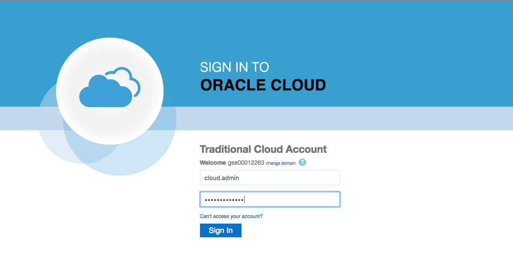
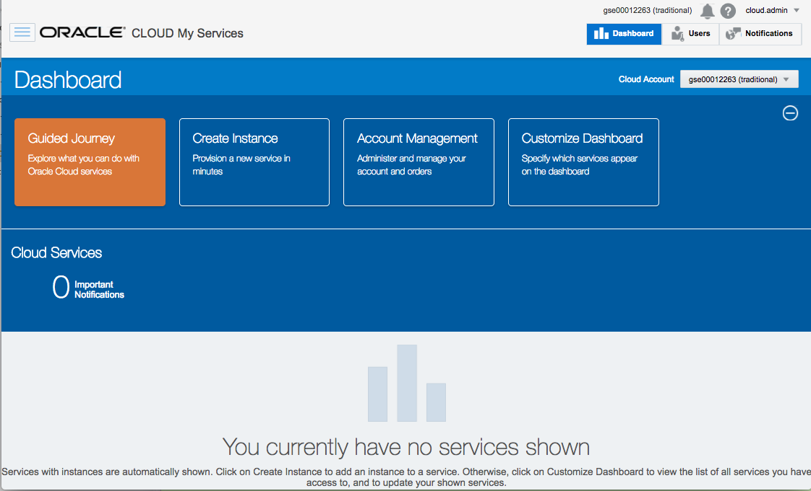
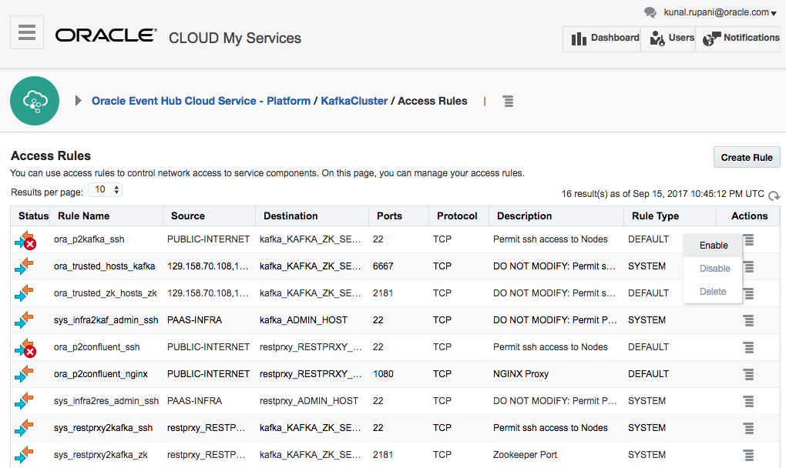

# Welcome to Oracle Open World 2017 - EventHub Hands On Lab

## Introduction

EventHub Cloud Service is Oracle's Open Source Kafka Streaming Data service. In this lab, you will be seting up an EventHub Cluster in Oracle Cloud and stream data through it. This lab is devided into 3 sections

**Section#1**: Setting up an EventHub Cluster (Apache Zookeeper, Kafka Brokers), Configure and Create a Kafka Topic

**Section#2**: SSH into the EventHub Cluster and use Kafka built in tools to produce and consume data

**Section#3** (Advanced): Deploy a Microservice app (NodeJS) in Application Container Cloud Service

## Prerequisites
- Internet access on your laptop
- Oracle Cloud Account user name, password, data center infomation ( this will be provided in the lab)
- Ability to SSH to the Oracle Cloud from your Terminal (Mac) or Putty (Windows).Download a pre-made public and private ssh key from the GitHub repo. You will use these keys to SSH into the EventHub Cluster

### **Section#1**: Setting up an EventHub Cluster (Apache Zookeeper, Kafka Brokers), Configure and Create a Kafka Topic

### Step 1: Login to the Oracle Cloud

Log into Oracle Cloud : https://cloud.oracle.com/en_US/sign-in

**Select _Traditional Cloud Account_ and Data Center to be us2**

**Select EventHub - Dedicated Cloud Service**

**Go to the Service console**

### Step 2: Create your EventHub Cluster

**Give the cluster a name of your choice**

**Use the previously downloaded (see prerequisites) ssh public key and complete the configuration. Use defaults for all**

**Once the above step is complete - the cluster should be created in a couple minutes**

### Step 3: Create a Topic in your cluster

**Go to EventHub-Topics Console**

**Give the topic a name, use the defaults for the remaining configuration**
**Note that the name of the topic created will be of the format _identitydomainname-TopicName_**

### Congratulations!.
### You have now successully created an EventHub Cluster and are ready to produce and consume high throughput streams !

## **Section#2**: SSH into the EventHub Cluster and use Kafka built in tools to produce and consume data

### Step1: SSH access to the cluster is disabled by default. You would need to enable in first. Follw the steps in the screenshots below to enable it.

### Step 2: SSH into your cluster
- **ssh -i <private-key> opc@<ip-address-of-your-node>**

- **sudo su oracle**

- **cd /u01/oehpcs/confluent/bin**

### Step 2: Start the producer and the consumer

#### Start the Producer
- **./kafka-console-producer.sh --broker-list <ip-address-of-your-node>:6667 --topic  <identityDomain-nameofyourtopic>**

#### Follow Step 1 again in a different window and start the Consumer
- **./kafka-console-consumer.sh --bootstrap-server <ip-address-of-your-node>:6667 --topic  <identityDomain-nameofyourtopic> --from-beginning**

### Step 3: Send data

Type text/characters in the producer window. You will see the strings passed through EventHub and received on the consumer window

### Step 4: Misc.

The directory has several other command line tools to use - for instance you can type the below command to describe the topic configurtion
- **./kafka-topics.sh --describe --zookeeper localhost:2181 --topic <identityDomain-nameofyourtopic>**

### Congratulations!.
### You have completed Section#2. If you still have time left - please proceed to Section#3

## **Section#3** (Advanced): Deploy a Microservice app (NodeJS) in Application Container Cloud Service

# Upload to Oracle Application Container Cloud

## Producer application

- Access the **Applications** list view

- Click **Create Application** and select **Node**.

- In the **Create Application** section, enter a name for your application, replace the **Notification Email** address with your own (or leave it blank) and click **Choose File** next to **Archive**
- On the File Upload dialog box, select the `TwitterProducerApp.zip` file and click **Open**
- Click **Choose File** next to **Deployment Configuration**
- On the File Upload dialog box, select the `deployment.json` file click **Open**
- Finally, click **Create** to start the application deployment

Once the application is deployed, you should see it in the **Applications** menu

Producer application starts pushing tweets in real time to Oracle Event Hub Cloud once it gets deployed

## Consumer application

- In the Applications list view, click **Create Application** and select **Java EE**.

- In the **Create Application** section, enter a name for your application, replace the Notification Email address with your own (or leave it blank) and click **Choose File** next to **Archive**
- On the File Upload dialog box, select the `accs-kafka-tweet-consumer.war` file and click **Open**
- Click **Choose File** next to **Deployment Configuration**
- On the File Upload dialog box, select the `deployment.json` file click **Open**
- Finally, click **Create** to start the application deployment

Once the application is deployed, you should see it in the **Applications** menu

# Access the application

## Consumer application

To start seeing the tweet stream, open the consumer application URL in your browser - e.g. `https://TwitterConsumerApp-test.apaas.us2.oraclecloud.com`

## Change tweet filter criteria

If you want to change the hashtag for the tweets you want to see, just use the following URL `<ACCS_PRODUCER_APP_URL>/hashtag/<your_hashtags>` e.g. `https://TwitterProducerApp-test.apaas.us2.oraclecloud.com/hastag/hurricane,java,kafka`
